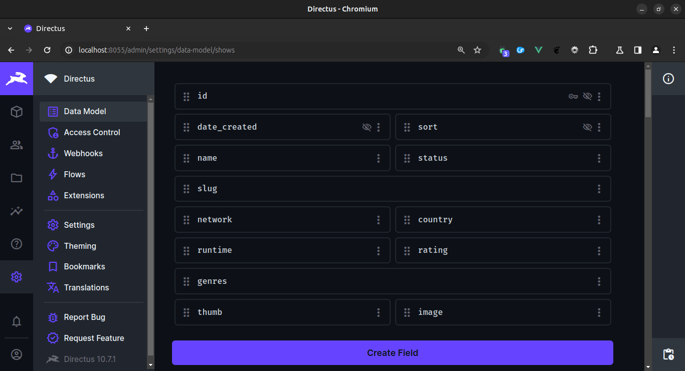
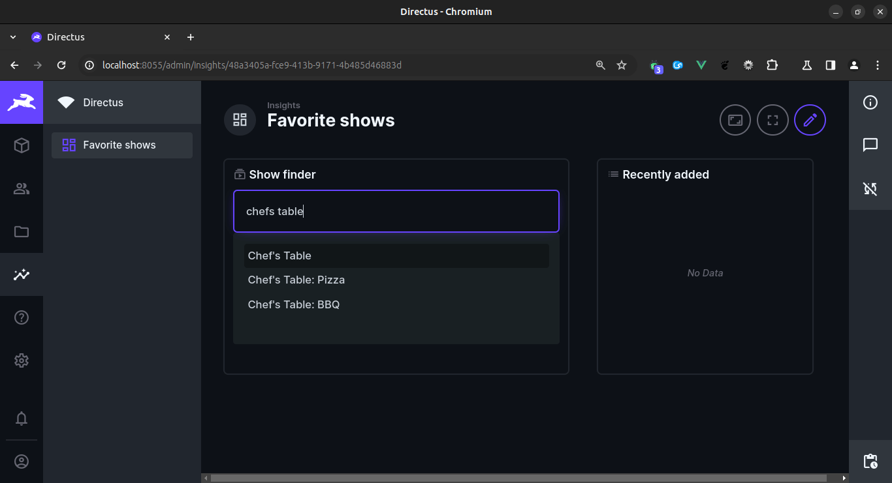
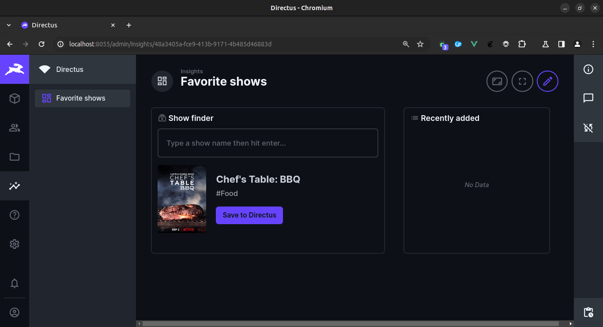

# Directus API Fetch

Connect to the 3rd-party api's (via the bundled custom endpoint '/api-lookup?q=[query]'), then add selected items to your configured collection.

## Details

- Speed up the process of adding items from external sources.
- No, I intentionally only used what is natively available.
- One endpoint and one panel.
- I would extend it support more data sources (contacts from Clearbit, books from OpenLibrary, plants from Trefle, etc). I would also add more views, filters and the ability to automatically create the collection.

## Set Up Instructions

The endpoint uses the TVMaze api, which doesn't require any token to api key.

0) Add the extension to your Directus extensions directory.
1) Restart Directus.
2) Create a new collection to store your saved videos. To match the api response the collection should have the following fields:
    2.1) name: string
    2.2) date_created: datetime | timestamp
    2.3) slug: string string | slugify
    2.4) network: string
    2.5) country: string
    2.6) runtime: integer
    2.7) genre: csv | tags
3) Add a new panel and select the API Lookup panel from the list of available panels.
4) Select a collection you would like to save to.
5) Select the name column from the Response configuration field.
6) Once the panel is added to your dashboard, simply search for items in the TVMaze database, select an item from the results then click save to Directus.

## Screenshots

## Video preview

